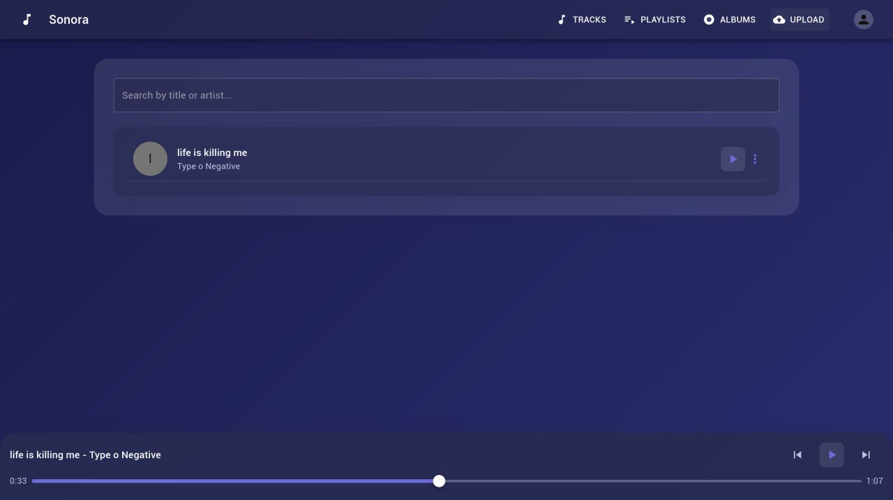
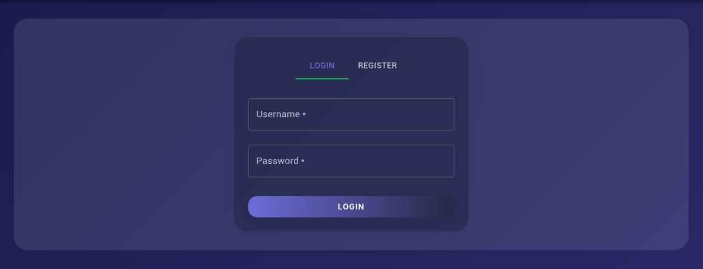

# Sonora - Music Streaming Application



## Структура проекта

```
sonora/
├── backend/          # FastAPI backend
├── frontend/         # React frontend
├── media/           # Медиа файлы
└── docker-compose.yml
```

## Запуск с Docker Compose

### Предварительные требования

- Docker
- Docker Compose

### Быстрый запуск

1. Клонируйте репозиторий:
```bash
git clone <repository-url>
cd sonora
```

2. Запустите все сервисы:
```bash
docker-compose up -d
```

3. Откройте приложение:
- Frontend: http://localhost:5173
- Backend API: http://localhost:8001
- База данных: localhost:5433

### Остановка

```bash
docker-compose down
```

### Просмотр логов

```bash
# Все сервисы
docker-compose logs

# Конкретный сервис
docker-compose logs backend
docker-compose logs frontend
docker-compose logs db
```

## Сервисы

### Backend (FastAPI)
- **Порт**: 8001
- **Технологии**: FastAPI, SQLAlchemy, PostgreSQL
- **Функции**: API для управления треками, альбомами, плейлистами

### Frontend (React)
- **Порт**: 5173
- **Технологии**: React, TypeScript, Material-UI, Vite
- **Функции**: 
  - Пользовательский интерфейс для прослушивания музыки
  - Регистрация и авторизация пользователей
  - Загрузка треков с обложками
  - Создание плейлистов
  - Лайки и избранное
  - Поиск по трекам

### База данных (PostgreSQL)
- **Порт**: 5433
- **База данных**: mini_spotify
- **Пользователь**: spotify
- **Пароль**: spotify

## Разработка

### Запуск в режиме разработки

```bash
# Запуск только базы данных
docker-compose up db -d

# Запуск backend в режиме разработки
docker-compose up backend -d

# Frontend уже запущен в режиме разработки
```

### Пересборка контейнеров

```bash
docker-compose up --build
```

## API Endpoints

- `GET /tracks` - Получить все треки
- `POST /upload` - Загрузить новый трек
- `GET /track/{track_id}` - Получить конкретный трек
- `POST /register` - Регистрация пользователя
- `POST /login` - Вход в систему
- `GET /albums` - Получить все альбомы
- `GET /playlists` - Получить все плейлисты
- `POST /playlists/create` - Создать плейлист
- `POST /playlists/{id}/add_track` - Добавить трек в плейлист
- `POST /tracks/{id}/like` - Поставить лайк треку
- `POST /tracks/{id}/unlike` - Убрать лайк с трека
- `GET /liked_tracks` - Получить понравившиеся треки	
